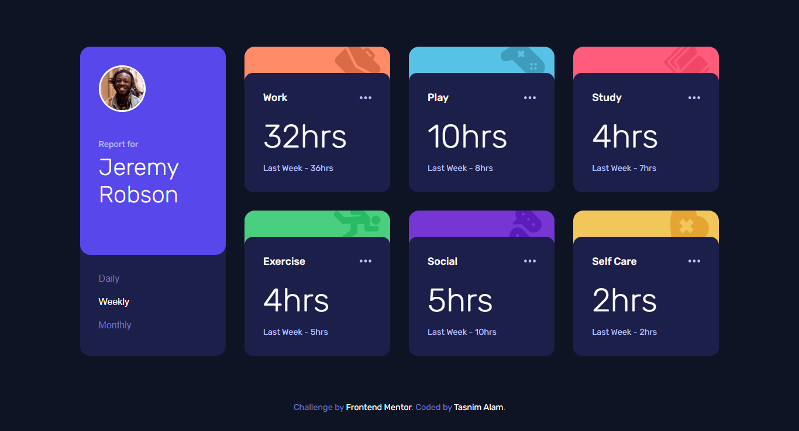
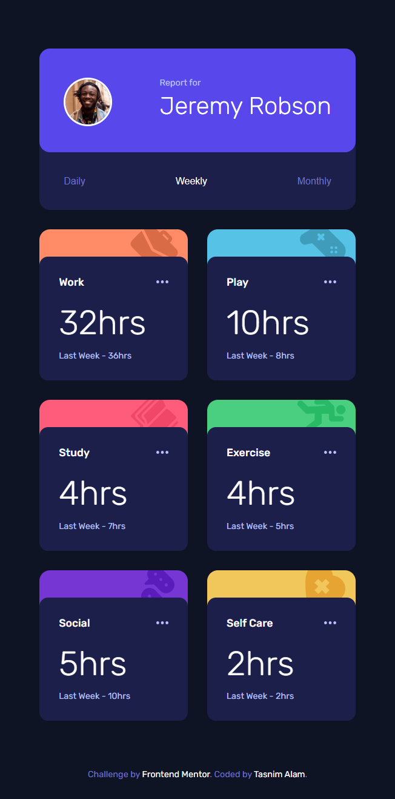
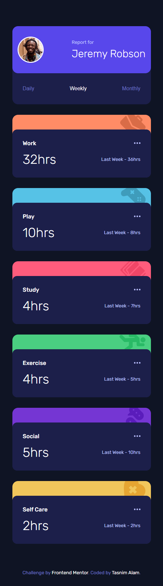

# Frontend Mentor -Dynamic Time tracking dashboard solution using Fetch API

This is a solution to the [Time tracking dashboard challenge on Frontend Mentor](https://www.frontendmentor.io/challenges/time-tracking-dashboard-UIQ7167Jw). Frontend Mentor challenges help you improve your coding skills by building realistic projects. 

## Table of contents

- [Overview](#overview)
  - [The challenge](#the-challenge)
  - [Screenshot](#screenshot)
  - [Links](#links)
- [My process](#my-process)
  - [Built with](#built-with)
  - [What I learned](#what-i-learned)
- [Author](#author)


## Overview

### The challenge

Users should be able to:

- View the optimal layout for the site depending on their device's screen size
- See hover states for all interactive elements on the page
- Switch between viewing Daily, Weekly, and Monthly stats

### Screenshot






### Links

- Solution URL: [Repository](https://github.com/Tasnim005/Time-tracking-dashboard-using-Fetch-API)
- Live Site URL: [Live Preview](https://tasnim005.github.io/Time-tracking-dashboard-using-Fetch-API/)

## My process

### Built with

- Semantic HTML5 markup
- Flexbox
- CSS Grid
- Fetch API


### What I learned

```js
for(let i=0; i<titles.length; i++){
    fetch('data.json')
    .then((response)=>response.json())
    .then((data)=>{
        titles[i].textContent = data[i].title
        times[i].textContent = `${data[i].timeframes.weekly.current}hrs`
        timeFrames[i].textContent = `Last Week - ${data[i].timeframes.weekly.previous}hrs`
        weeklyButton.style.color = '#fff'
        
        dailyButton.addEventListener('click', showDailyData)
        function showDailyData(){
            times[i].textContent = `${data[i].timeframes.daily.current}hrs`
            timeFrames[i].textContent = `Last Day - ${data[i].timeframes.daily.previous}hrs`
            dailyButton.style.color = '#fff'
            weeklyButton.style.color = '#6f76c8'
            monthlyButton.style.color = '#6f76c8'
        }
    })
}

}
```

## Author
- Website - [Tasnim Alam](https://github.com/Tasnim005)
- Frontend Mentor - [Tasnim005](https://www.frontendmentor.io/profile/Tasnim005)


